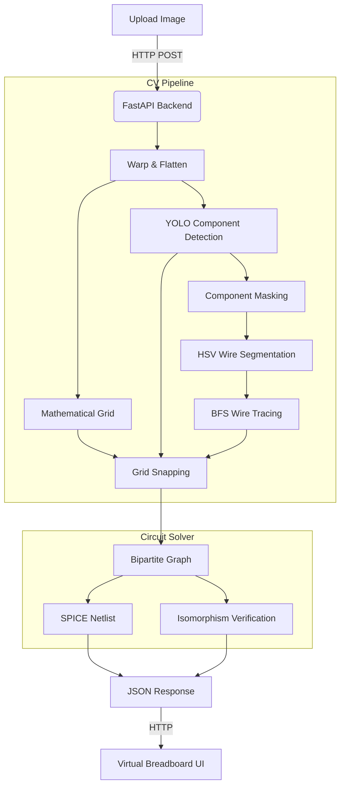

# Toaster 🍞 — Slide Deck (15 Slides)

> **AI-Powered Breadboard → SPICE Netlist Converter**

---

## Slide 1 — Title Slide

**Title:** Toaster 🍞 — From Physical Breadboard to Digital Circuit  
**Subtitle:** An AI-powered Computer Vision tool that photographs a breadboard and generates a verified SPICE netlist.

### Content
- Project name + logo
- Tagline: *"Photograph your breadboard. Get a SPICE netlist."*
- Team name / Author name
- Date / Course info (if academic)

### Suggested Visual
- A split-screen image: physical breadboard photo on the left → virtual breadboard SVG render on the right (before/after)

### Speaker Notes
> Introduce the project name "Toaster" and the core idea — take a photo of a physical breadboard, and the system auto-generates a SPICE netlist for simulation. Mention why the name: a toaster has slots like a breadboard.

---

## Slide 2 — Problem Statement & Motivation

**Title:** The Problem: Bridging Physical Circuits to Digital Simulation

### Content
- **The Gap:** Students and hobbyists build circuits on breadboards but struggle to manually transcribe them into SPICE simulators (LTSpice, NGSpice).
- **Pain Points:**
  - Manual netlist writing is tedious and error-prone.
  - Misidentifying a single wire connection can cause simulation mismatches.
  - No existing tool photographs a breadboard and outputs a ready-to-run `.cir` file.
- **Our Solution:** Use Computer Vision + ML to automate the entire pipeline: **Photo → Detection → Netlist → Verification**.

### Suggested Visual
- Side-by-side: (1) a student struggling with a breadboard and a SPICE editor, (2) a single-click upload producing a netlist.

### Speaker Notes
> Highlight the real-world friction: circuit prototyping is hands-on, but simulation is entirely software-based. Toaster bridges the two seamlessly.

---

## Slide 3 — High-Level System Architecture

**Title:** System Architecture Overview

### Content
- **Three-Layer Stack:**
  1. **Frontend** — React + TypeScript + Vite (Interactive Virtual Breadboard)
  2. **Backend** — FastAPI (Python) + OpenCV + YOLOv8 (CV Pipeline + Solver)
  3. **ML Models** — Custom-trained YOLOv8 for component detection + wire keypoint detection
- **Data Flow (one sentence):** Upload image → Orthorectify → Detect components & wires → Snap to grid → Build circuit graph → Generate SPICE → Render interactive SVG

### Suggested Visual
- The Mermaid diagram from `system_architecture_and_workflow.md`:

### Speaker Notes
> Walk through the diagram top-to-bottom. Emphasize the separation: the backend does all "hard math" (CV, graph theory), while the frontend is a rich interactive editor.

---

## Slide 4 — Image Calibration & Orthorectification

**Title:** Step 1: Correcting Camera Perspective

### Content
- **Problem:** Photos taken from an angle introduce perspective distortion — the grid holes don't line up.
- **Solution: 2-Step Calibration Wizard**
  1. **Marker Detection** — Auto-detects 4 printed corner markers using Otsu's thresholding + contour analysis (`cv2.findContours`, `cv2.moments`). User can drag-adjust.
  2. **Perspective Transform** — `cv2.getPerspectiveTransform` + `cv2.warpPerspective` flattens to a standard **928×586** top-down view.
  3. **Crop Box Refinement** — Pre-warp to 1600×1600 canvas, then the user drags a bounding box for the plastic edges of the breadboard.
- **Precision View:** A 3× magnifier loupe during drag for sub-pixel accuracy.

### Suggested Visual
- Screenshot of the CalibrationOverlay UI showing the 4 draggable markers over a breadboard photo, with the magnifier loupe visible.

### Speaker Notes
> Emphasize that reliability starts here. If calibration is off, every grid hole is misaligned, and all downstream detection fails. The 2-step wizard balances automation with user control.

---

## Slide 5 — Mathematical Grid Generation

**Title:** Step 2: Calculating 882 Hole Positions Without Looking

### Content
- **Key Insight:** Detecting 882 tiny holes visually is unreliable. Instead, we calculate positions mathematically using physical constants:
  - `pitch = 14.15 px` (distance between holes)
  - `paddingX = 26 px`, `paddingY = 22 px` (board edge offset)
  - 14 row groups × 63 columns = **882 holes** per breadboard half
- **Row Layout:** Maps to real breadboard anatomy:
  - Rows 1–2: Power rails (+/−)
  - Rows 4–8: Top terminal block (columns share a conductor strip)
  - Rows 11–15: Bottom terminal block
  - Rows 17–18: Ground rails
- **Labeling:** Each hole gets a canonical ID (e.g., `TopTerminal_5`, `Power+`, `Ground-`) for netlist mapping.

### Suggested Visual
- Diagram of a breadboard showing the row groupings (power rails, terminal blocks, trench) annotated with the calculated coordinates.

### Speaker Notes
> This is a "math over vision" approach. We trust physical manufacturing tolerances (~0.1mm) more than pixel-level blob detection. The result: perfectly repeatable grid coordinates.

---

## Slide 6 — YOLO Component Detection

**Title:** Step 3: AI-Powered Component Recognition

### Content
- **Model:** Custom-trained **YOLOv8 OBB** (Oriented Bounding Boxes)
  - Classes: Resistor, Capacitor, LED, Transistor (BJT/MOSFET), IC
  - Conf threshold: `0.20`, IoU threshold: `0.25`
- **Terminal Extraction Algorithm:**
  - **2-pin** (R, C, LED, Diode): Midpoints of the two shortest bounding-box edges → the wire legs.
  - **3-pin** (Transistor): Three equally-spaced points along the longest edge.
  - **N-pin** (IC DIP): Two parallel rows along the longest edge, spacing based on edge ratio (8-pin or 16-pin auto-detection).
- **Grid Snapping:** Every extracted terminal pixel is mapped to the nearest mathematical grid hole using Euclidean distance.

### Suggested Visual
- An annotated warped breadboard image showing YOLO bounding boxes overlaid on detected components, with terminal extraction points marked as colored dots.

### Speaker Notes
> Highlight the OBB advantage — oriented bounding boxes handle rotated components, unlike standard axis-aligned boxes. The terminal extraction is geometry-based, not ML.

---

## Slide 7 — Wire Detection via Color Morphology

**Title:** Step 4: Classic CV Wire Tracing

### Content
- **Why not YOLO for wires?** Wires are thin, overlap, and have no distinct shape — YOLO struggles with segmentation.
- **Pipeline:**
  1. **Component Masking** — Paint detected component regions black (`cv2.fillPoly`) to avoid false positives (e.g., red resistor body ≠ red wire).
  2. **HSV Color Segmentation** — 9 color channels: Red, Orange, Yellow, Green, Blue, Purple, Pink, Brown, Black. Each has specific `[H, S, V]` ranges.
  3. **Morphological Operations:**
     - Open (3×3 kernel) — remove noise
     - Close (**cross kernel** 15×15) — bridge gaps without merging adjacent parallel wires
  4. **BFS Endpoint Extraction** — Find the two extremes of each connected blob.
  5. **Smart Merge** — If two same-color blobs are collinear and gap < 4×pitch, fuse them (heals wires split by overlapping wires).

### Suggested Visual
- A multi-panel figure: (1) Original image, (2) Component-masked image, (3) HSV color mask for one color (e.g., Red), (4) BFS endpoints marked.

### Speaker Notes
> The cross-kernel is critical — a rectangular closing kernel would fuse two parallel red wires into one blob. The cross shape only bridges perpendicular gaps.

---

## Slide 8 — Circuit Graph & SPICE Generation

**Title:** Step 5: From Physical Layout to Electrical Netlist

### Content
- **Node Map Construction (`build_node_map`):**
  - Each breadboard terminal strip is a "net" (conductor)
  - Jumper wires merge two nets into one (Union-Find style multi-pass propagation)
  - Ground rails → Node 0
- **SPICE Netlist Output:**
  - Components: `R1 N0001 N0002 1k`
  - Prefix mapping: R=Resistor, C=Capacitor, D=LED, Q=Transistor, V=Voltage Source
  - Continuous node renumbering for SPICE compatibility
  - Output ends with `.backanno` + `.end`
- **Live Regeneration:** Users can edit values/connections in the UI and hit "Update Board" to instantly regenerate the netlist via the backend `/solve-circuit` endpoint.

### Suggested Visual
- A small breadboard circuit example (e.g., voltage divider) with arrows showing how physical holes map to net IDs, and the resulting 3-line SPICE netlist.

### Speaker Notes
> The key insight: wires are not components in the graph. They are net mergers. Two strips become one conductor. This makes the graph compact and SPICE-native.

---

## Slide 9 — Graph Isomorphism Verification

**Title:** Step 6: Is This Circuit Correct?

### Content
- **Use Case:** A student builds a circuit and wants to verify it matches a given schematic.
- **Approach: Bipartite Graph Isomorphism**
  1. Parse a reference SPICE netlist using `SpiceParser` → build reference graph (`G_ref`)
  2. Build detected graph from CV output (`G_det`)
  3. Use **NetworkX `GraphMatcher`** for subgraph isomorphism with custom matchers:
     - **Node Match:** Component type + normalized value (handles `1k` = `1000`)
     - **Edge Match:** Pin roles (`anode/cathode` for LEDs, `collector/base/emitter` for BJTs)
     - Symmetric components (R, C) → pin roles set to `'symmetric'`
  4. **Ground Anchoring:** Node `0` in reference must map to node `0` in detected.
- **Diagnostic Report:** On failure, shows a value comparison table (reference vs. detected).

### Suggested Visual
- Two side-by-side bipartite graphs (reference vs detected) with nodes colored by type (component=blue, net=green) and a ✅ or ❌ result.

### Speaker Notes
> This is what makes Toaster educational. It doesn't just digitize — it grades. A lab instructor could define a reference netlist, and students verify their builds instantly.

---

## Slide 10 — Interactive Virtual Breadboard (Frontend)

**Title:** The Virtual Breadboard — A Full Circuit Editor

### Content
- **SVG Canvas** (928×586 viewBox) renders the breadboard, components, and wires interactively.
- **Core Features:**
  - **Drag & Drop** components with real-time grid snapping (yellow snap targets)
  - **Ghost Preview** — translucent clone stays at original position during drag
  - **Add Components** via modal: Resistor, Capacitor, Transistor, Voltage Source, LED, Diode, IC
  - **Draw Wires** — crosshair mode, click-to-place endpoints
  - **Edit Popover** — modify Name, Value, Type, Rotation, and individual Terminals
  - **Undo/Redo** — full state history with Ctrl+Z / Ctrl+Y
  - **Photo Overlay** — toggle original warped photo behind the grid for comparison
- **Cursor-Mount Mode:** New components follow the cursor as a ghost until clicked to place.

### Suggested Visual
- Screenshot of the Virtual Breadboard UI with a circuit loaded, showing components, wires, the toolbar, and an edit popover open on a resistor.

### Speaker Notes
> This isn't a static viewer — it's a full editor. Users can correct any CV mistakes, add missing components, rewire, and re-solve. The goal is CV + Human in the loop.

---

## Slide 11 — Procedural SVG Component Rendering

**Title:** Realistic Component Visuals

### Content
- **No sprites or images** — every component is procedurally drawn with SVG paths, dynamically scaling to grid span and rotation.
- **Component Renderers:**
  | Type | Visual Style | Key Detail |
  |------|-------------|------------|
  | Resistor | Tan body + color band stripes | Bands from footprint config |
  | Capacitor | Blue ceramic disc | Value stamped on center |
  | LED | Colored dome + flat base | Color parsed from `value` field (Red/Green/Blue/Yellow) |
  | Diode | Black body + cathode stripe | Standard 1N4148 look |
  | Transistor | 3-pin white box | Leads to C/B/E pins |
  | IC | Black DIP package | Straddles trench, semi-circle notch, N leads |
  | Voltage Source | Green body + ±  terminals | Red anode / Blue cathode dots |
- **Pin Position Engine (`getGridPinPixels`):** Trigonometric matrix → supports any rotation (0°, 90°, 180°, 270°) and arbitrary pin counts.

### Suggested Visual
- A gallery/carousel of each component type rendered on the breadboard grid.

### Speaker Notes
> Every pixel is calculated from the grid. There are no hardcoded screen coordinates. This means components render correctly at any position, any rotation, any span.

---

## Slide 12 — Manhattan Wire Routing

**Title:** Smart Wire Routing with Collision Avoidance

### Content
- **Constraint:** All wires rendered as 90° orthogonal paths (Manhattan geometry) for readability.
- **Routing Algorithm (`manhattanize`):**
  1. Try **L-shape** (horizontal → vertical). Check for component collision.
  2. Try **Reverse L-shape** (vertical → horizontal). Check collision.
  3. If both collide → try **Z-shape doglegs** with offsets (±1, ±2, ±3 × pitch).
  4. Last resort: render the L-shape despite collision.
- **Collision Detection (`intersectsComponent`):** Tests if an axis-aligned segment intersects any component's bounding box.
- **Visual Polish:**
  - SVG paths with **rounded corners** (quadratic Bézier, `targetRadius = 13px`)
  - **Gravity sag** on long horizontal segments (4px downward `Q` curve)
  - Drop shadows for depth

### Suggested Visual
- Diagram showing a wire routing around a component: (1) simple L blocked by a resistor, (2) Z-shape dogleg routing around it.

### Speaker Notes
> This isn't just cosmetic. Without collision avoidance, wires render through components, making the diagram unreadable. The Z-shape dogleg is iterative — it tries 6 offsets before giving up.

---

## Slide 13 — Tech Stack & Project Structure

**Title:** Technology Stack & Codebase

### Content
- **Frontend:**
  - React 18 + TypeScript + Vite
  - Lucide Icons, react-hot-toast
  - Vanilla CSS (no Tailwind)
  - Key files: `App.tsx` (main), `VirtualBreadboard.tsx` (520 LOC), `ComponentVisuals.tsx` (481 LOC), `wirePathing.ts` (176 LOC)
- **Backend:**
  - FastAPI (Python 3.12) with Uvicorn
  - OpenCV (`cv2`) — warping, morphology, BFS
  - Ultralytics YOLOv8 — OBB component detection + keypoint wire detection
  - NetworkX — graph isomorphism
  - `uv` package manager
  - Key files: `cv_engine.py` (527 LOC), `circuit_solver.py` (166 LOC), `graph_utils.py` (164 LOC)
- **API Endpoints:**
  | Endpoint | Method | Purpose |
  |----------|--------|---------|
  | `/analyze-image` | POST | Full CV pipeline |
  | `/solve-circuit` | POST | Regenerate netlist |
  | `/verify-circuit` | POST | Isomorphism check |
  | `/detect-corners` | POST | Auto-detect markers |
  | `/pre-warp` | POST | Orthorectify preview |

### Suggested Visual
- A layered architecture diagram: Frontend box → API arrows → Backend box → sub-boxes for CV, Solver, ML.

### Speaker Notes
> Total codebase is ~3000 LOC of meaningful logic across frontend and backend. No bloated frameworks — every dependency earns its place.

---

## Slide 14 — Live Demo / Walkthrough

**Title:** Demo: End-to-End Workflow

### Content (step-by-step flow for live demo or screenshots)
1. **Upload** a breadboard photo on the landing page
2. **Calibration Wizard** — auto-detected markers, drag to refine, draw crop box
3. **CV Processing** — loading spinner, backend returns JSON
4. **Virtual Breadboard** appears with detected components & wires
5. **Click a Resistor** → edit popover → change value from `1k` to `4.7k`
6. **Add a Wire** → crosshair mode → click two holes → wire appears with Manhattan routing
7. **Update Board** → backend regenerates SPICE netlist
8. **Verification Panel** → paste reference netlist → click "Verify Circuit" → ✅ or ❌
9. **Export** → Save project as JSON, reload anytime

### Suggested Visual
- A horizontal filmstrip / carousel showing screenshots of each step 1–9.

### Speaker Notes
> If presenting live, have a pre-loaded test JSON (`test_divider.json`) ready as a fallback in case the camera/upload step encounters issues.

---

## Slide 15 — Future Work & Conclusion

**Title:** Roadmap & Conclusion

### Content
- **Immediate Enhancements:**
  - 🔴 Auto-detect resistor color bands via secondary OCR/color model
  - 🔴 Improve YOLO accuracy for crowded boards and poor lighting
  - 🟡 Dockerize for one-command deployment
  - 🟡 Add request validation + rate limiting for API hardening
- **Stretch Goals:**
  - Integrated SPICE simulation (run NGSpice in-browser via WASM)
  - Multi-breadboard support (detect and stitch 2+ boards)
  - Mobile camera support with real-time AR overlay
  - Lab grading system: instructor defines reference → students scan → instant feedback
- **Conclusion:**
  - Toaster demonstrates that **CV + Graph Theory + Interactive UI** can fully automate breadboard digitization.
  - The tool is modular: the CV pipeline, solver, and frontend are independently deployable and extensible.
  - Goal: make circuit education faster, more accessible, and less error-prone.

### Suggested Visual
- A roadmap timeline graphic showing completed features (✅) vs. planned features (🔜).

### Speaker Notes
> End on the "vision" — Toaster isn't just a class project, it's a framework. The verification engine alone could power a lab auto-grading system. Thank the audience and invite questions.

---

## Appendix — Quick Reference

| Slide | Topic | Time (approx) |
|-------|-------|-------------:|
| 1 | Title | 0:30 |
| 2 | Problem Statement | 1:30 |
| 3 | Architecture | 2:00 |
| 4 | Calibration | 1:30 |
| 5 | Grid Generation | 1:30 |
| 6 | YOLO Detection | 2:00 |
| 7 | Wire Tracing | 2:00 |
| 8 | SPICE Generation | 1:30 |
| 9 | Verification | 2:00 |
| 10 | Virtual Breadboard UI | 2:00 |
| 11 | Component SVG Rendering | 1:30 |
| 12 | Wire Routing | 1:30 |
| 13 | Tech Stack | 1:00 |
| 14 | Demo | 3:00 |
| 15 | Future Work & Conclusion | 1:30 |
| **Total** | | **~25 min** |
