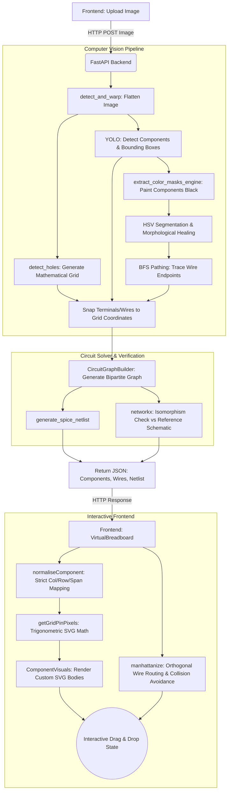

# Toaster: Exhaustive System Architecture & Data Flow

This document provides a highly detailed, component-level breakdown of the Toaster project. It traces the exact data transformations, algorithmic approaches, and state management patterns from physical image ingestion to interactive SVG rendering.

---

## High-Level Workflow Diagram

---

## 1. Backend: Computer Vision & Digitization Pipeline
The core responsibility of the Python/FastAPI backend (`backend/app/cv_engine.py`) is to translate a raw photograph into a mathematically structured dataset.

### 1.1 Pre-Processing & Orthorectification
- **Marker Detection (`detect_and_warp`)**: The system converts the image to grayscale, applies a `5x5` Gaussian blur, and uses Otsu's thresholding (`cv2.THRESH_OTSU`) to create a binary mask. It extracts contours (`cv2.findContours`) and uses image moments (`cv2.moments`) to filter out the four largest calibration markers (often printed on the breadboard's corners).
- **Perspective Transform**: The centers of these markers are ordered (Top-Left, Top-Right, Bottom-Right, Bottom-Left) using sum and difference heuristics (`np.argmin(s)`, `np.argmax(diff)`). `cv2.getPerspectiveTransform` generates a transformation matrix, and `cv2.warpPerspective` mathematically flattens the image into a strict `928x586` top-down projection.

### 1.2 Mathematical Grid Generation
Instead of attempting unreliable visual detection for hundreds of tiny holes, the system calculates their physical locations mathematically using absolute physical constants:
- `pitch = 14.15` pixels (the physical distance between two holes).
- `paddingX = 26`, `paddingY = 22` (the offset from the top-left edge of the physical board).
- `rows_relative`: An array defining the exact layout of a standard full-size breadboard (e.g., rows `1, 2` for top power rails, `4-8` for the top terminal block, `11-15` for the bottom terminal block, and `17, 18` for bottom power rails).
- The `detect_holes` function maps these 63 columns and 14 rows into exact `(x, y)` pixel coordinate tuples.

### 1.3 YOLO Component Detection
- **Inference**: A custom-trained Ultralytics YOLO model (`best_components.pt`) scans the flattened image with an IoU threshold of `0.25` and a confidence threshold of `0.20`. It outputs oriented bounding boxes (OBB) for classes like `resistor`, `capacitor`, `ic`, `led`, and `transistor`.
- **Terminal Extraction (`extract_component_terminals`)**: The algorithm calculates where the physical metal legs of the component touch the board:
  - For a standard 2-pin part, it takes the midpoints of the two shortest edges of the bounding box.
  - For a 3-pin Transistor, it spaces three points equally along the longest edge.
  - For an IC (Logic chip), it detects the orientation of the box based on edge ratios and maps out two parallel rows of equidistant pins (e.g., 4 pins per side).
- **Grid Snapping (`map_terminals_to_holes`)**: Using the Euclidean distance formula, every extracted terminal pixel is snapped to the nearest mathematical grid hole, assigning it a logical ID like `TopTerminal_5`.

### 1.4 Classic Wire Extraction via Color Morphology
To detect wires that YOLO struggles to segment precisely:
- **Component Masking**: The areas inside the YOLO bounding boxes are painted black (`cv2.fillPoly`) so that a red resistor body isn't misidentified as a red wire.
- **HSV Segmentation (`extract_color_masks_engine`)**: The image is converted to HSV color space. Strict array bounds are used to isolate specific colors (Red, Orange, Yellow, Green, Blue, Purple, Pink, Brown, Black).
- **Morphological Healing**: The system applies an "Opening" operation to remove noise, followed by a specific `cv2.MORPH_CROSS` "Closing" operation. The cross-kernel bridges perpendicular gaps in reflections without accidentally fusing adjacent parallel wires.
- **BFS Pathing (`detect_wires_classic`)**: A Breadth-First Search traverses every connected colored blob to find its two extreme endpoints (`E1` and `E2`).
- **Smart Merging**: If a wire is visually split (e.g., occluded by another wire), the algorithm evaluates the gap distance (must be `< 4 * pitch`) and checks collinearity (does the distance from `A` to `B`, `B` to `C`, and `C` to `D` approximately equal the distance from `A` to `D`?). If true, the blobs are fused.

---

## 2. Backend: Circuit Solving & Verification
Once the physical board is digitized, it must be evaluated electrically (`backend/app/circuit_solver.py` & `graph_utils.py`).

### 2.1 Bipartite Graph Generation
- The physical layout is translated into a computational graph (`CircuitGraphBuilder`).
- The graph is Bipartite: it consists of **Net Nodes** (representing physical conductive strips in the breadboard) and **Component Nodes** (representing the resistors, LEDs, etc.).
- Jumper wires do not exist as independent entities in the graph; instead, they act as "Net Mergers," mathematically fusing two previously independent terminal strips into a single super-node.

### 2.2 Isomorphism Verification (`verify-circuit`)
- The system parses a user-provided ideal SPICE netlist using standard regex parsing (`spice_parser.py`) and builds a reference bipartite graph.
- The `networkx.algorithms.isomorphism` module is used to perform a full topological comparison between the detected physical graph and the ideal reference graph. This verifies the circuit's correctness regardless of arbitrary net naming conventions or component declaration ordering.

---

## 3. Frontend: Interactive Virtual Breadboard
The React/Vite frontend (`frontend/src/components/VirtualBreadboard.tsx`) visualizes the digitized circuit and allows the user to manually edit or extend it via a highly interactive SVG canvas.

### 3.1 State Management & Normalization
- The `VirtualBreadboard` component manages complex, synchronous state updates for both `localComponents` and `localWires`.
- **Normalization (`normaliseComponent`)**: Because the backend computer vision engine provides raw physical bounding boxes, the frontend immediately normalizes these into strict logical units upon load:
  - `col` (0-62)
  - `row` (1-38)
  - `span` (number of columns occupied)
- All physical rendering from that point forward is strictly derived from these logical coordinates to prevent compounding sub-pixel errors.

### 3.2 Dynamic SVG Component Visuals (`ComponentVisuals.tsx`)
Instead of static sprites, components are procedurally drawn using SVG paths, scaling and rotating based on their grid `span` and `rotation` values.
- **`getGridPinPixels`**: A trigonometric matrix engine that translates logical grid coordinates into physical screen pixels `[x, y]`. It handles arbitrary pin counts (`pins: number`) and Dual In-line Package (`isDIP`) layouts, correctly calculating precise offsets for top and bottom rows of pins.
- **Dynamic Renderers**:
  - `LedBody`: Draws a transparent SVG dome pointing strictly upwards (`-Y` space), dynamically assigning the `fill` based on the component's `value` string.
  - `IcBody`: Draws a large black bounding box traversing the breadboard trench, plotting custom silver leads mapping dynamically to all `N` pins.
  - `ResistorBody` & `CapacitorBody`: Draw procedurally generated geometric primitives with custom color banding and text labels.

### 3.3 Interactive Manhattan Routing (`wirePathing.ts`)
To prevent wires from creating a tangled, unreadable mess, the `manhattanize` engine forces all paths into strictly orthogonal (90-degree) geometries.
- If an endpoint `(x1, y1)` and `(x2, y2)` are diagonal, the engine routes an L-shape path via a midpoint `(x2, y1)`.
- **Collision Detection (`intersectsComponent`)**: The router checks if the proposed L-shape overlaps with the bounding box of any placed component.
- **Dogleg Z-Shapes**: If an intersection is detected, the engine attempts to route around the component using Z-shapes. It iteratively applies vertical offsets (`pitch`, `-pitch`, `pitch * 2`, `-pitch * 2`) to the midpoint until a clear path is found, ensuring the diverted wire stays perfectly aligned with the visual grid holes.

### 3.4 Interactive Drag & Drop Event System
- **Drag State Tracking**: The `VirtualBreadboard` tracks dragging intents using a tagged union type (`DragState`): `'component'`, `'pin1'`, `'pin2'`, or `'wirePoint'`.
- **Ghosting**: During a drag, a low-opacity `isGhost={true}` clone of the component is left in its original position to indicate the revert state.
- **Snap Targets**: As the component moves over the board, the system calculates the exact Euclidean layout of its `N` pins and draws yellow target circles under the cursor, indicating exactly which holes the component will snap into when released.
- **Live Terminal Editing**: A popover modal (`edit-popover`) allows users to manually re-assign the metadata (Type, Name, Value, Rotation) of any component. Changing the component type dynamically triggers a resizing algorithm that truncates or pads the underlying `terminals` array to match the physical pin count of the new footprint.
